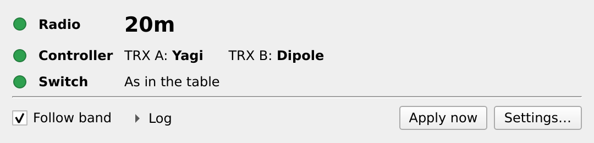
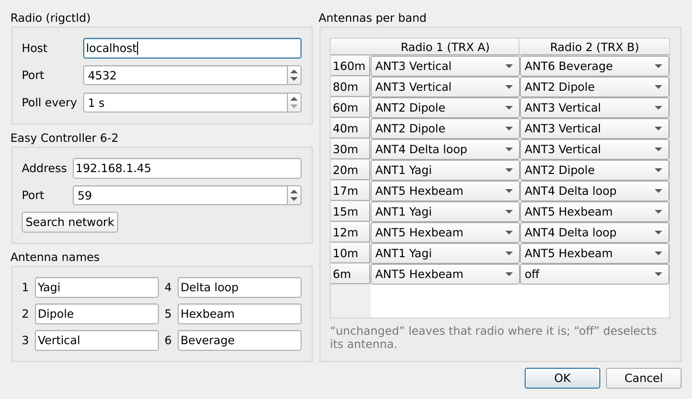
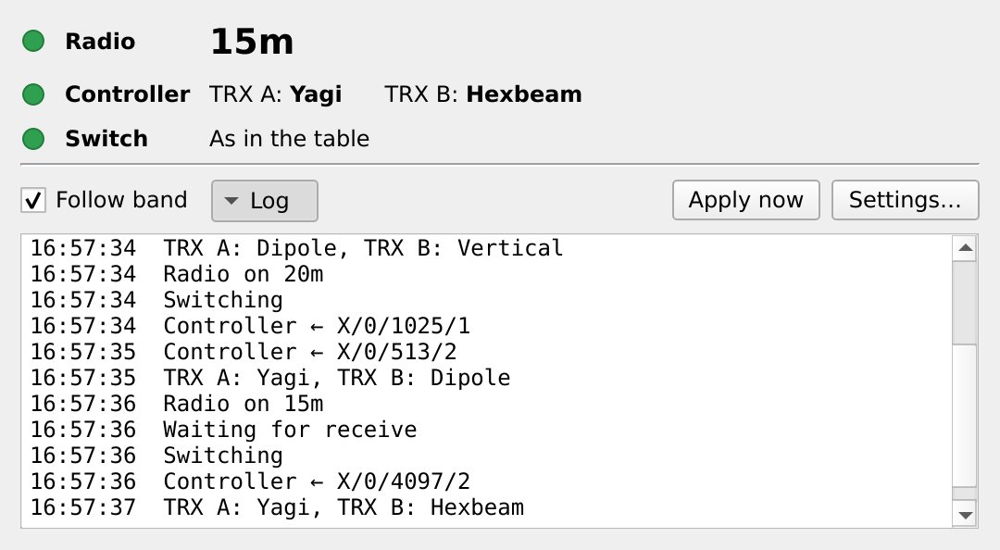

<p align="center"></p>

<h1 align="center">Easy Controller Hamlib</h1>

<p align="center"><b>Hamlib band decoder for the QRO.cz Easy Controller 6-2.</b><br>
Your radio changes band, the antennas follow.</p>

<p align="center">
<a href="https://oh2gba.github.io/qro-easy-controller-hamlib/">Project page</a> ·
<a href="https://github.com/oh2gba/qro-easy-controller-hamlib/releases">Downloads for Linux, Windows and macOS</a>
</p>



A small desktop app that switches the antennas of a [QRO.cz Easy Controller 6-2](https://hamparts.shop/easy-controller-6-2.html)
(and the 6-to-2 antenna switch behind it) by the band of your radio. It reads the band from Hamlib's `rigctld`, the
same one QLog, WSJT-X and other programs already use, and tells the controller over your network which antenna each
of the two radios gets.

Move the radio to 20 m and TRX A goes to ANT1, TRX B to ANT2; move to 40 m and TRX A goes to ANT2, TRX B to ANT3,
whatever your band table says.

## Download

| System | File | First start |
|---|---|---|
| Linux (x86-64) | `qro-easy-controller-hamlib-linux-x86_64.AppImage` | `chmod +x` the file, then run it |
| Windows 10 / 11 | `qro-easy-controller-hamlib-windows-x64.zip` | unzip, run `qro-easy-controller-hamlib.exe`; SmartScreen: *More info* → *Run anyway* |
| macOS 13+ (Apple silicon and Intel) | `qro-easy-controller-hamlib-macos.dmg` | drag to Applications; first open: *System Settings* → *Privacy & Security* → *Open Anyway*, then allow local network access |

All files are on the [releases page](https://github.com/oh2gba/qro-easy-controller-hamlib/releases). They are not
signed with a paid certificate, hence the one-time questions.

## What it does

- **Follows the band.** When the radio enters another band, both banks of the controller go to the antennas in your
  table. Per band and radio: an antenna, *off*, or *unchanged*. Between bands nothing changes.
- **Switches only on receive.** While the radio, or the controller's PTT input for either bank, is transmitting, the
  change waits.
- **Never fights first-win.** The controller keeps the first radio on an antenna; commands go out in an order where
  neither radio asks for the antenna the other one holds. A table row with both radios on one antenna is refused.
- **Finds the controller.** *Search network* in the settings finds it. When the stored address stops answering at a
  band change, it searches the local network once, stores the address it finds and switches; if nothing answers,
  the switch indicator turns red, and it switches as soon as the controller answers again.
- **Keeps trying.** Polls `rigctld` once a second (adjustable) as one more client; with the radio or `rigctld` away it keeps
  polling and shows the radio as not connected.
- **Shows the state.** The band, the antenna of each radio, and a switch indicator: green when the antennas are as
  in the table, yellow when they differ (someone switched by hand; **Apply now** puts the table back), red when the
  controller cannot be reached. TX per radio, and a log of every command.

The search resolves `sixbytwo.local` and `impero`, and probes every address of each attached IPv4 subnet (at most a
/24 per interface; container, virtual machine and VPN adapters are skipped) on the controller port. A host counts
only when it completes the WebSocket upgrade and answers with the controller's state.

## Getting started

1. Put the Easy Controller on your network: enable its WiFi and join your access point, as in the
   [6-2 Easy Controller manual](https://hamparts.shop/blog/6-2-easy-controller-manual.html).
2. Have `rigctld` running for your radio. If your logger starts it, nothing to do; otherwise for example
   `rigctld -m <model> -r <serial port>`, which listens on port 4532.
3. Start Easy Controller Hamlib. The settings open on the first start; the radio is `localhost`, port `4532`.
4. Press **Search network**; the controller's address fills in when it answers.
5. Name your antennas and fill in the band table.



The main window has **Follow band** to pause automatic switching, **Apply now** to put the current band's antennas
back after a manual change, and **Log**:



On Linux the program adds itself to the application menu (a desktop entry and icons in `~/.local/share`), which is
also where Wayland desktops take the window icon from; a checkbox in the settings turns this off and removes them.
Settings are stored per user (`~/.config/qro-easy-controller-hamlib/` on Linux, `%APPDATA%` on Windows).
`--config <file>` uses another file; `--verbose` writes the log to standard error.

## The controller protocol

The Easy Controller has no published interface. This app speaks the WebSocket protocol of the vendor's web page,
`ws://<controller>:59/xxws`:

| Message | Meaning |
|---|---|
| `G` → `{"B0": mask}` | state; bits 0–5 TRX A ports 1–6, bit 6 TRX A USED, bits 8–13 TRX B ports 1–6, bit 14 TRX B USED |
| `X/0/<mask>/<bank>` | select ports; `bank` 1 = TRX A, 2 = TRX B |
| `{"IsPTT1": 0\|1}`, `{"IsPTT2": 0\|1}` | pushed by the controller on PTT changes |

It is in use at OH2GBA with a real Easy Controller 6-2 and tested against a simulated controller and Hamlib's
`rigctld`; reports from other stations are welcome in the [issues](https://github.com/oh2gba/qro-easy-controller-hamlib/issues). The controller's own
interlocks (first win, PTT hot-switch protection) stay in force whatever the app sends.

## Build from source

Qt 6.2 or later (Core, Gui, Widgets, Network) and CMake. On Debian or Ubuntu:

```sh
sudo apt install build-essential cmake qt6-base-dev
cmake -S . -B build -DCMAKE_BUILD_TYPE=Release
cmake --build build
./build/qro-easy-controller-hamlib
```

`cmake --install build --prefix ~/.local` installs the program, a desktop entry and the icons.

Or in Docker, with nothing installed on the host:

```sh
scripts/dev.sh build    # toolchain image (Debian trixie, Qt 6, Hamlib), then build/ with the tests
scripts/dev.sh test     # all tests, in a container without network
scripts/dev.sh shots    # screenshots of the windows into build/shots
scripts/dev.sh icons    # PNG, .ico and .icns from data/qro-easy-controller-hamlib.svg
```

The release packages are built by GitHub Actions ([build.yml](.github/workflows/build.yml)): an AppImage on Ubuntu
22.04, a zip with the Qt and Visual C++ runtime on Windows, a universal disk image on macOS. A tag `v*` publishes them
as a release; a tag with a dash (`v0.2.0-beta.1`) as a pre-release.

### Trying it without the hardware

The test build includes a simulated controller:

```sh
./build/fake-easycontroller --listen 127.0.0.1 --port 5959
```

Set the controller address to `127.0.0.1`, port `5959`. Without a radio, `rigctld -m 1` is Hamlib's dummy radio, and
`rigctl -m 2 F 14074000` moves it to 20 m.

### Tests

`scripts/dev.sh test` runs, in a container without network:

- **core**: band table, command ordering, settings, the WebSocket client against Qt's WebSocket server, the
  controller driver against the simulator (first win, PTT lock, link loss).
- **rig**: polling `rigctld` with Hamlib's dummy radio, plain and `--vfo` mode, restarts and silence.
- **engine**: band following end to end, waiting for receive, a band change during a switch, finding a moved
  controller, nothing found, two controllers found, other services on the port.
- **discovery**: the subnet scan on a dummy interface (10.99.0.0/24) inside the container.
- **ui**: the windows, conflicts in the band table, the search filling the address, the log pane.

## Licence

GPL-3.0, see [LICENSE](LICENSE).

## Not affiliated

Easy Controller Hamlib is an independent project, not affiliated with or endorsed by QRO.cz. *Easy Controller* is
a product of QRO.cz; Hamlib is the [Hamlib project](https://hamlib.github.io/).
